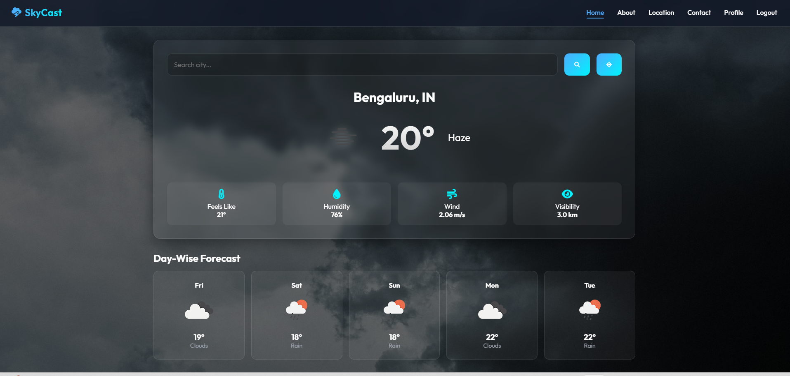
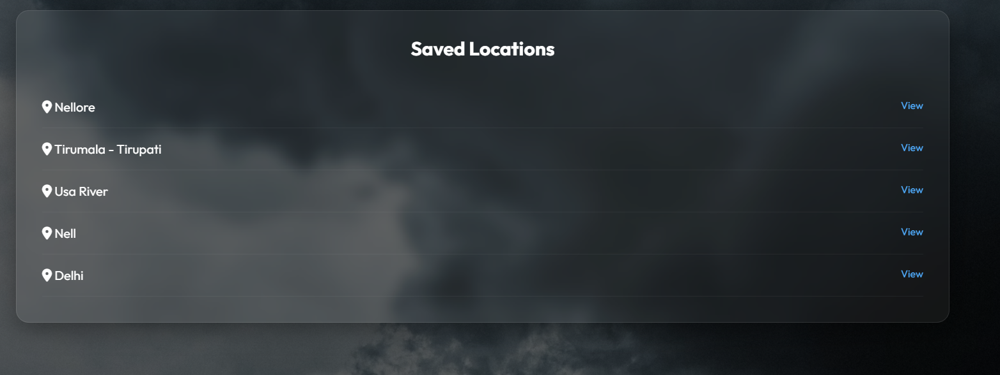
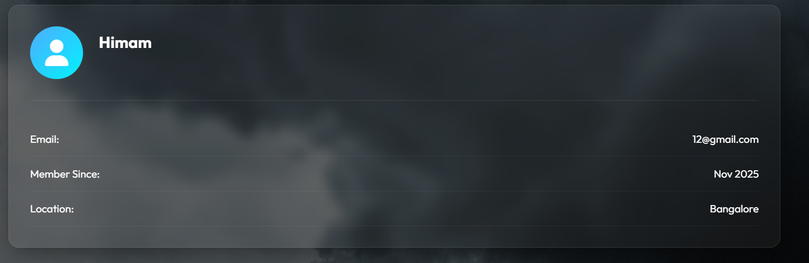

<p align="center">
  
</p>

<h1 align="center">⛅ Weather Forecast Application</h1>

<p align="center">
  A clean and responsive web application that provides real-time temperature, humidity, wind speed, and weather conditions using a live Weather API — built using HTML, CSS & JavaScript.
</p>

<p align="center">
  <a href="#-project-overview">Overview</a> •
  <a href="#-tech-stack--tools">Tech Stack</a> •
  <a href="#-features">Features</a> •
  <a href="#-screenshots">Screenshots</a> •
  <a href="#-getting-started">Getting Started</a> •
  <a href="#-how-it-works">How It Works</a> •
  <a href="#-license">License</a>
</p>

---

## 🌩️ Project Overview

The Weather Application allows users to search for any city worldwide and view accurate climate details such as  
**temperature**, **weather condition**, **humidity**, **wind speed**, and matching **dynamic icons**.  
The UI is smooth, minimalistic, and responsive — ideal for showcasing in portfolios.

---

## 📹 Demo Video
<p align="center">
  <video src="YOUR_VIDEO_LINK_HERE" width="500" controls></video>
</p>

---

## 🛠 Tech Stack & Tools

<p align="center">
  
</p>

- **Frontend:** HTML, CSS, JavaScript  
- **API Used:** OpenWeather API / AccuWeather API  
- **Other Tools:** Git, GitHub, VS Code  

---

## ⭐ Features

- 🌍 Search weather by city name  
- 🌡 Displays temperature in °C  
- 🌬 Shows humidity & wind speed  
- 🎨 Clean, responsive UI  
- 🌦 Dynamic weather icons (sunny, cloudy, rainy, mist, etc.)  
- ⚠️ Error message for invalid city name  

---

## 📸 Screenshots

> > All screenshots are resized to keep the README clean and neat.

## 🖼 Screenshots

### Row 1
<table align="center">
  <tr>
    <td align="center">
      <br>
      <b>🏠 Main Page</b>
    </td>
    <td align="center">
      <br>
      <b>📍 Saved Location</b>
    </td>
    <td align="center">
      <br>
      <b>👨 Profile</b>
    </td>
    <td align="center">
      <br>
      <b>🔐 Logout</b>
    </td>
  </tr>
</table>

---

## 🔧 How It Works

User enters the city name

JavaScript sends a request to the Weather API

Weather data is received in JSON format

UI updates automatically with temperature, humidity, wind & icons

---

## 🚀 Getting Started

### 1️⃣ Clone the Repo
git clone https://github.com/yourusername/weather-application.git

---

<p align="center"> ⭐ If you like this project, don't forget to star the repo! ⭐ </p> ```

